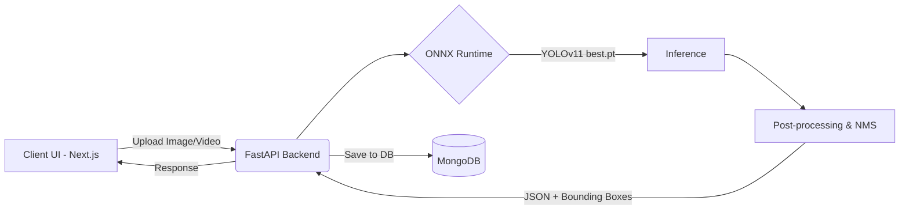

# CrackDetect AI - YOLOv11 SDNET


## 📌 Overview
CrackDetect AI is a comprehensive Artificial Intelligence system designed for Structural Health Monitoring (SHM). It automatically detects cracks in concrete structures (bridges, tunnels, walls, and pavements) using a state-of-the-art **YOLOv11** object detection model trained on the **SDNET2018** dataset.

The project features a **FastAPI backend** for high-performance ONNX inference, and a beautiful, responsive **Next.js frontend** for visualizing results and managing inspections.

---

## ✨ Features
- **Accurate Detection:** Powered by YOLOv11, achieving an impressive `mAP@0.5` of **94.7%** and an F1-Score of **0.87**.
- **Multi-Surface Support:** Trained to identify cracks across Decks (D), Pavements (P), and Walls (W) from the SDNET dataset.
- **Fast Inference:** Optimized ONNX runtime CPU inference processing single-pass predictions for rapid results.
- **Video & Image Support:** Upload high-resolution images or videos (auto-extracts keyframes to save bandwidth/compute).
- **Interactive Dashboard:** Tracks inspection history and severity statistics (powered by MongoDB).
- **Cloud-Ready:** Pre-configured for deployment on Render (Backend) and Vercel (Frontend).

---

## 🏗️ Architecture



---

## 🚀 Getting Started (Local Development)

### Prerequisites
- Node.js (v18+)
- Python (3.9+)
- MongoDB (Optional, for saving history)

### 1. Backend Setup
Navigate to the `backend` directory and set up the Python environment:

```bash
cd backend
python -m venv venv
source venv/bin/activate  # On Windows use: venv\Scripts\activate
pip install -r requirements.txt
```

Create a `.env` file in the `backend` directory (optional):
```env
MONGO_URL=your_mongodb_connection_string
```

Run the FastAPI server:
```bash
uvicorn main:app --reload --port 8000
```
*The backend will be running at `http://localhost:8000`*

### 2. Frontend Setup
Navigate to the `frontend` directory and install dependencies:

```bash
cd frontend
npm install
```

Create a `.env.local` file in the `frontend` directory:
```env
NEXT_PUBLIC_API_URL=http://localhost:8000
```

Start the Next.js development server:
```bash
npm run dev
```
*The frontend will be running at `http://localhost:3000`*

---

## 🌍 Deployment

### Deploying the Backend (Render)
The backend includes a `render.yaml` blueprint. You can deploy it directly to Render by connecting your GitHub repository.
- Ensure the **Build Command** is `pip install -r requirements.txt`
- Ensure the **Start Command** is `uvicorn main:app --host 0.0.0.0 --port $PORT`
- Add `MONGO_URL` to the Environment Variables in the Render dashboard.

### Deploying the Frontend (Vercel)
The frontend is optimized for Vercel. 
1. Connect your repository to Vercel.
2. Select the `frontend` directory as the Root Directory.
3. Add the `NEXT_PUBLIC_API_URL` environment variable pointing to your deployed Render backend URL.
4. Deploy!

---

## 📊 Model Performance Metrics
- **mAP@0.5:** 94.7%
- **mAP@0.5:0.95:** 94.0%
- **F1-Score:** 0.87 (at Confidence = 0.454)
- **Precision:** 88%+
- **Recall:** 85%+
- **Dataset:** SDNET2018 (~56,000 images, 2 classes: Crack & Background, 3 surface types)

---

## 🛠️ Built With
- **Frontend:** Next.js 16, React, Tailwind CSS v4, TypeScript
- **Backend:** FastAPI, Python, ONNX Runtime, OpenCV, PyMongo
- **AI Model:** Ultralytics YOLOv11

---

## 📄 License
This project is licensed under the MIT License.
